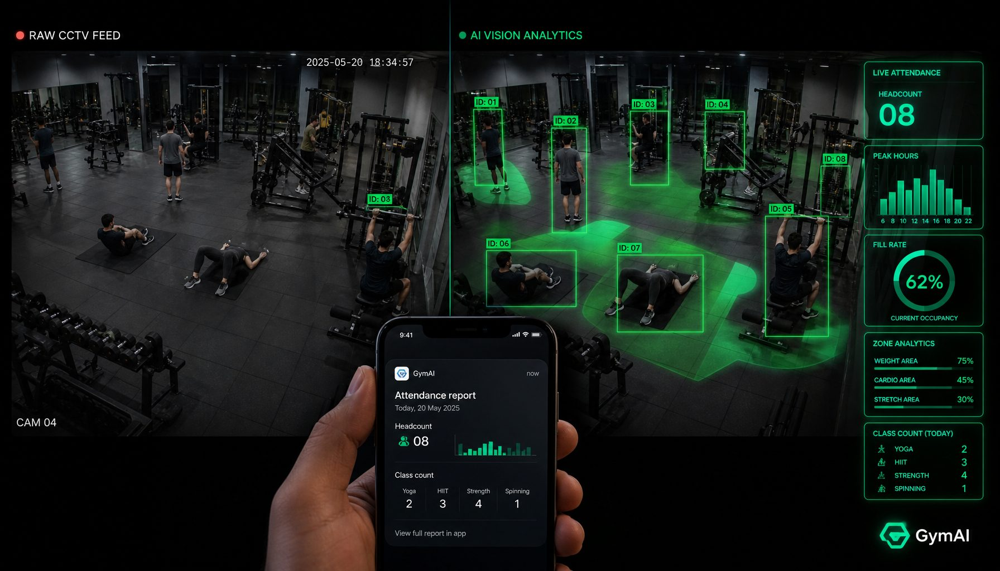

# GymCam Analytics

GymCam turns the cameras a gym already has into automatic attendance and trainer-performance analytics — **no new hardware, no check-ins**.



Feed it the existing CCTV stream and the class schedule; it recognizes trainers, counts attendees per class, and reports what's actually happening: which classes are full, which are dead, and which trainers fill the room.

## Why

Gym owners run on gut feeling. Booking software (Mindbody, Glofox) only captures check-ins — and people skip check-ins, so the data is incomplete. Hardware people-counters (Density, V-Count) cost thousands and count bodies without context.

GymCam reuses what's already in the building and maps counts to **classes and trainers** — the thing that actually drives revenue.

## What it reports

- **Today's summary** — classes held, total attendance, top classes
- **Trainer attendance** — daily/weekly fill rate and no-show rate per trainer
- **Class performance** — every class ranked by fill rate, so dead classes are obvious
- **Revenue insights** — most profitable vs. least profitable classes

## What you actually get

- **Zero install** — cameras already do the counting (security cameras are required in nearly every country). No sensors, no mounting, no new hardware.
- **No check-in friction** — stop making members do a meaningless task; people just show up.
- **Class truth** — which classes are full and which are dead, not the paper log anyone can fudge.
- **Trainer accountability** — real fill rate + no-shows per trainer; the "16 becomes 20" rounding dies.
- **Occupancy & density** — overfull classes and cramped rooms are a pricing / scaling / staffing signal.
- **Room optimization** — see the big room idle while classes squeeze into the small one; swap and fix.
- **Equipment utilization** — which machines are actually used; sell, buy, or rearrange.
- **Density heatmaps** — attraction points and dead zones; change the layout with data.
- **Demographics** — gender + approximate age breakdown (within GDPR / local law).
- **Digital twin** — treat the gym as a measurable 3D space; a live model of what's working and what to cut.
- **AI-native** — an MCP server, so your AI agent reads the data and answers "how's my gym doing today."

## Install

One command, straight from this repo (requires [uv](https://astral.sh/uv)):

```bash
uvx --from git+https://github.com/axelfreeman/gymcamanalytics gymcam
```

## Connect to your AI agent

Same command, different config file per client.

**Claude Desktop** (`claude_desktop_config.json`):

```json
{"mcpServers": {"gymcam": {"command": "uvx", "args": ["--from", "git+https://github.com/axelfreeman/gymcamanalytics", "gymcam"]}}}
```

**Codex** (`~/.codex/config.toml`):

```toml
[mcp_servers.gymcam]
command = "uvx"
args = ["--from", "git+https://github.com/axelfreeman/gymcamanalytics", "gymcam"]
```

**Cursor** (`.cursor/mcp.json`) and **Windsurf** (`~/.codeium/windsurf/mcp_config.json`) use the same JSON block as Claude Desktop.

**Claude Code:**

```bash
claude mcp add gymcam -- uvx --from git+https://github.com/axelfreeman/gymcamanalytics gymcam
```

## API key

Tools require an API key. Get one free at **https://gymcamanalytics.com/get-key** (100 free lookups, no credit card), then set it:

```bash
export GYMCAM_API_KEY=your_key_here
```

## Tools

| Tool | What it returns |
|------|-----------------|
| `get_today_summary` | Classes held, total attendance, top classes |
| `get_trainer_attendance` | Fill rate + no-shows for a trainer (day/week) |
| `get_class_performance` | Classes ranked by fill rate |
| `get_revenue_insights` | Most profitable vs. dead classes |

## Status

Pre-launch. The MCP server and tool schema are live; tools return sample data until your gym's cameras are connected. [Sign up](https://gymcamanalytics.com) for access.

## License

MIT © 2026 Axel Freeman
